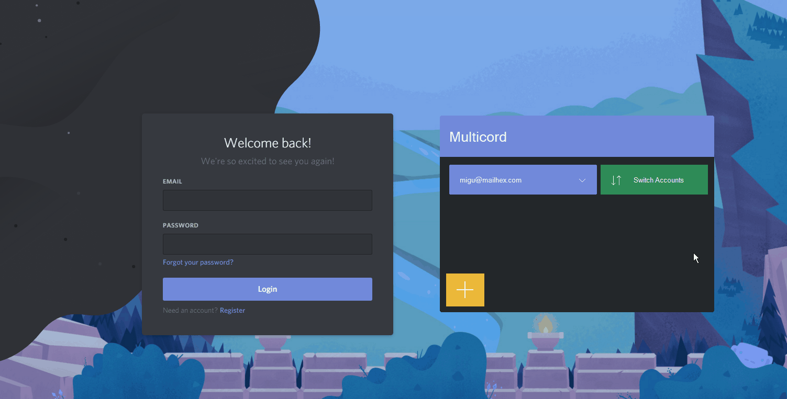
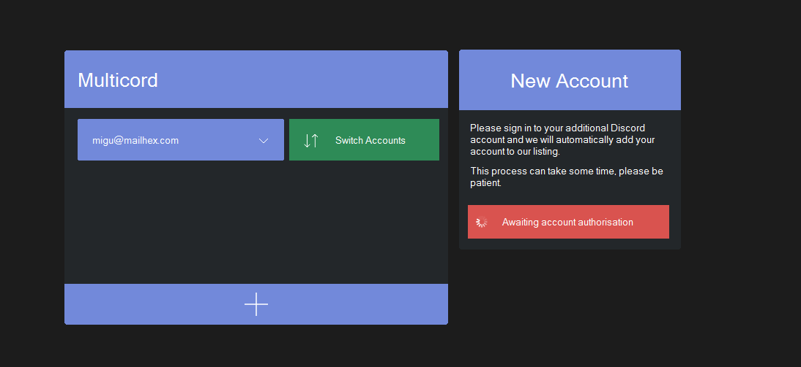

# Multicord
## Description
Multicord allows you to swiftly switch between multiple accounts without having to use the standard login.
## Example

This example simply shows the functionality of Multicord.

This shows partially how Multicord adds more accounts to data tables.